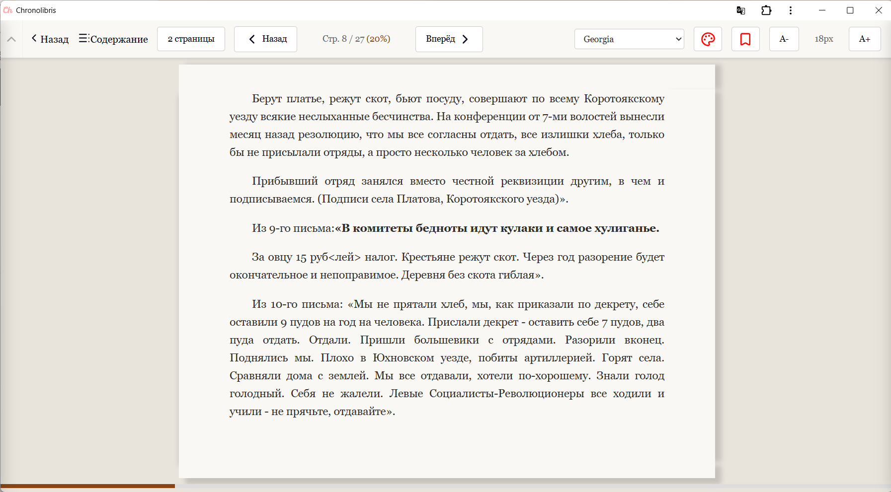
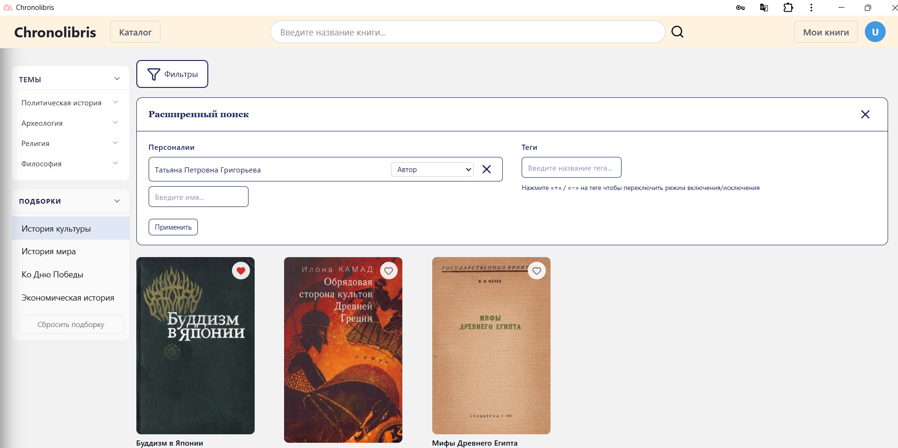

# Chronolibris 📚

**Chronolibris** is a modern, high-performance web application designed as a digital library for historical materials. The project aims to provide users with seamless access to historical literature, featuring advanced search capabilities and a responsive interface.

[](https://react.dev/)
[](https://www.typescriptlang.org/)
[](https://vitejs.dev/)
[](https://tailwindcss.com/)
[](https://vite-pwa-org.netlify.app/)

---

## 🖼️ Screenshots

<details>
  <summary>Click to view application interface</summary>
  <p align="center">
    
    
  </p>
  <p align="center">
    <i>Reader and historical archive catalog view.</i>
  </p>
</details>

---

## ✨ Features

- **Fuzzy Search:** Optimized PostgreSQL search using trigrams and GIN indexes for historical records.
- **Modern UI/UX:** Built with React 19, Shadcn UI, and Lucide icons for a clean, accessible experience.
- **Secure Access:** JWT-based authentication with secure cookie storage.
- **High Performance:** Client-side state management with Zustand and efficient data fetching via TanStack Query.
- **File Storage:** Integrated with MinIO for scalable and reliable storage of historical documents.

---

## 🛠️ Tech Stack

### Frontend

- **Framework:** React 19 (Vite)
- **Language:** TypeScript
- **State Management:** Zustand
- **Data Fetching:** TanStack Query (React Query) & Axios
- **Form Handling:** Standard controlled components with custom validation

### Backend / Infrastructure (Core Integration)

- **API Foundation:** .NET (C#)
- **Database:** PostgreSQL
- **Object Storage:** MinIO
- **Testing:** Vitest (Unit) & Postman (Load/API)

---

## 🚀 Getting Started

### Prerequisites

- Node.js (v18+)
- npm / pnpm

### Installation

1. Clone the repository:
   ```bash
   git clone [https://github.com/IgorK97/chronolibris-web.git](https://github.com/IgorK97/chronolibris-web.git)
   ```
2. Install dependecies:
   ```bash
   npm install
   ```
3. Set up environment variables for local dev
4. Start the development server
   ```bash
   npm run dev
   ```
